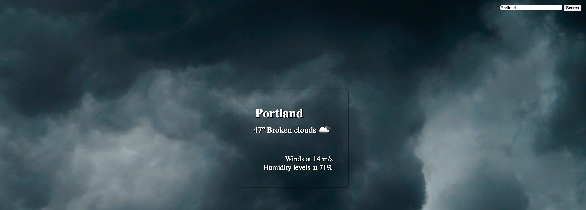
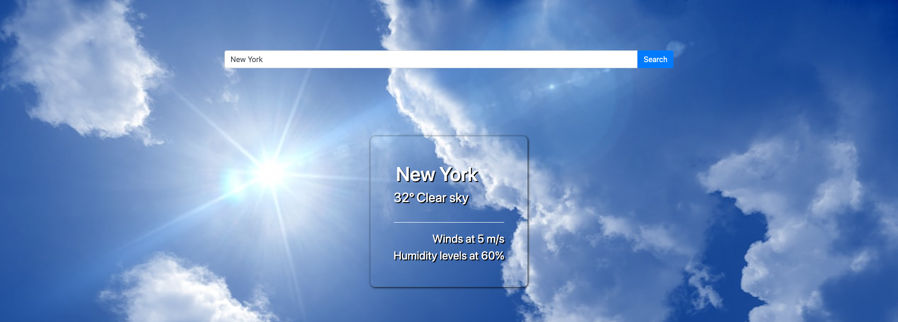

# OpenWeatherMapAPI
This is a page that shows the weather for different locations using OpenWeatherMap's API. This project consists of two versions, one that only uses Javascript and another that uses Jquery. This is a practice of how the same result can be achieved using either method. 

# What I learned
  * Comparison betwenen Javascript and jQuery
  * Use of fetch
  * Use of .get

# Screenshots
* Version 1 with only Javascript.

* Version 2 using jQuery.

